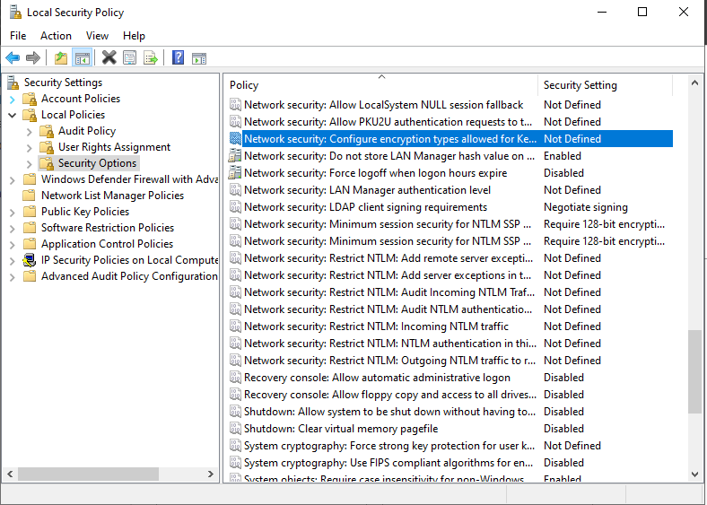
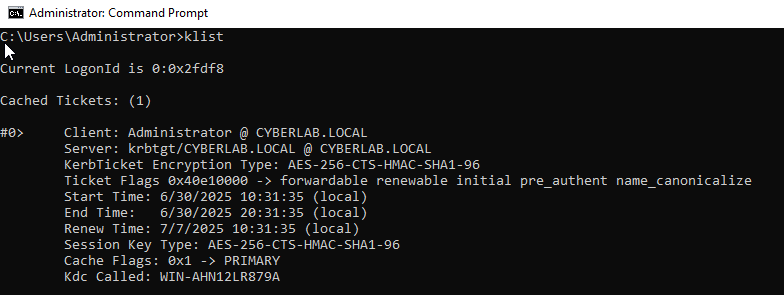
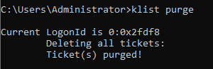
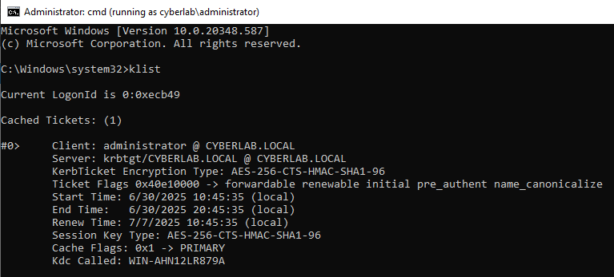
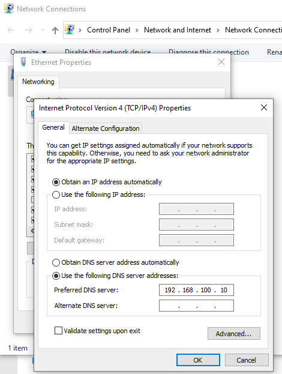
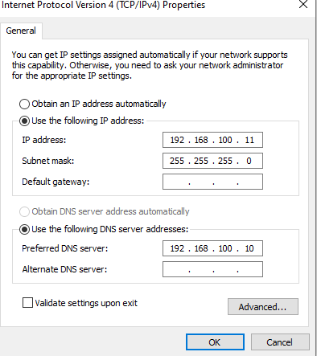
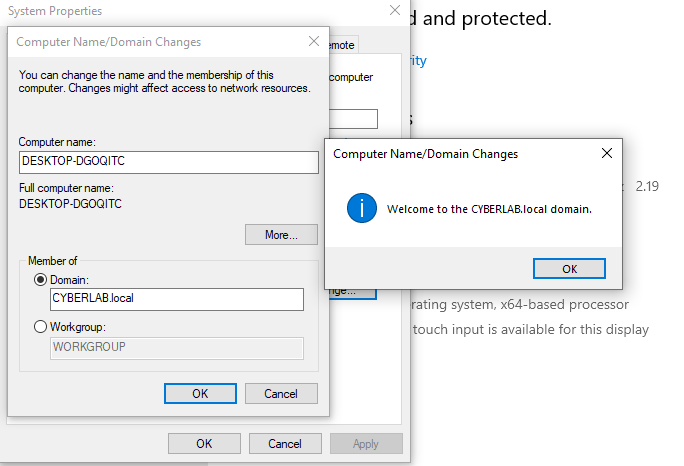
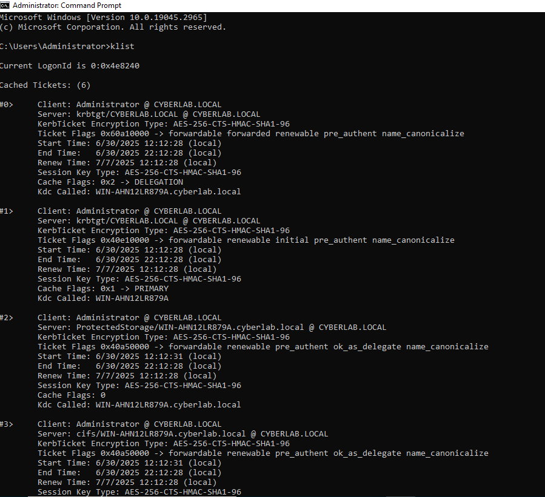

# 🔐 Lab 2: Configure Kerberos & Join a Client to the Domain

This lab builds on the [previous lab](https://github.com/blackgirlinfosec/windows-domain-controller-lab) where I set up a Domain Controller. Now, I’m configuring Kerberos and connecting a separate client machine to the domain. I also tested how Kerberos tickets are issued, purged, and verified.

I ran into plenty of realistic challenges along the way, like DNS resolution issues and domain join failures. This taught me how fragile domain trust and ticketing really are when configs are even slightly off.

---

## 🎯 Objectives

- Set up Kerberos encryption policy
- Purge and regenerate Kerberos tickets
- Configure static IP and DNS on the client
- Join the client to the domain
- Log in and verify Kerberos authentication from client side

---

## 🛠️ Setup & Commands

### 🧷 Step 1: Configure Kerberos Encryption Policy on DC  
I opened Local Security Policy and enabled AES-256 encryption.

---

### 🔍 Step 2: Verify Kerberos Ticket on DC  
I used `klist` to confirm the domain admin received a valid TGT.

---

### 🧹 Step 3a: Purge Tickets  
To simulate a clean session, I purged Kerberos tickets with `klist purge`.

---

### 🔁 Step 3b: Regenerate Ticket  
After re-logging in, a new TGT was issued automatically.

---

### 🌐 Step 4a: Configure Client DNS  
I manually set the client’s DNS to point to the domain controller.

---

### 🌍 Step 4d: Set Static IP on Client  
The client was assigned a private IP and subnet to match the domain controller.

---

### 🖥️ Step 4e: Join Client to the Domain  
This took a few tries. After correcting the client’s IP/subnet, it successfully joined the `CYBERLAB.LOCAL` domain.

---

### 🧾 Step 5: Verify Kerberos Ticket on Client  
I logged into the domain on the client machine and ran `klist`. Confirmed the TGT was issued and AES-256 encryption was in use.

---

## 🧠 What I Learned

- Kerberos uses **encryption types** (like AES-256) to secure tickets
- Tickets are stored in **RAM** and can be purged or stolen in certain attacks
- DNS setup is **crucial** — if the client can’t find the domain controller, Kerberos breaks
- Domain join failures are often caused by **IP/subnet mismatches or bad DNS**
- After login, Kerberos **automatically issues tickets**, no extra step needed

---
